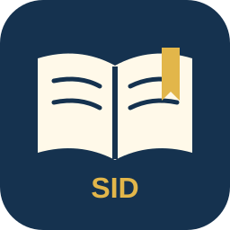
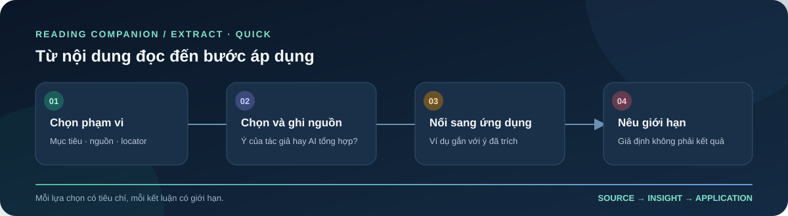

<p align="center">
  
</p>

<h1 align="center">Reading Companion</h1>

<p align="center"><strong>Trợ lý AI đọc sâu, trích xuất tri thức có nguồn và theo dõi tiến trình học tập</strong></p>
<p align="center"><em>A Vietnamese-first, source-grounded reading and knowledge-compilation plugin for ChatGPT and Codex.</em></p>

<p align="center">
  <a href="plugin.json"></a>
  <a href="https://github.com/Nohfinl99/Reading_Companion/actions/workflows/validate.yml"></a>
  <a href="LICENSE"></a>
  
</p>

<p align="center">
  <a href="#quick-start">Bắt đầu</a> ·
  <a href="#reading-modes">Chế độ đọc</a> ·
  <a href="#source-and-learning-state">Nguồn & tiến trình</a> ·
  <a href="#evaluation">Kiểm định</a> ·
  <a href="#maintainers">Bảo trì</a>
</p>

Reading Companion biến một phần sách hoặc tài liệu thành lời giải thích, đơn vị tri thức và bước học tiếp theo có thể truy ngược về nguồn. Người đọc chọn mục tiêu và phạm vi; Companion giữ mạch lập luận, locator, điều kiện áp dụng, trạng thái câu hỏi và giới hạn bằng chứng.

> **Nguyên tắc cốt lõi:** luôn phân biệt điều tài liệu nói với điều AI suy luận, chọn hoặc biên soạn.

<a id="table-of-contents"></a>
## Mục lục

1. [Tổng quan](#overview)
2. [Bắt đầu nhanh](#quick-start)
3. [Chọn chế độ đọc](#reading-modes)
4. [Nguồn, đơn vị tri thức và trạng thái học](#source-and-learning-state)
5. [Ví dụ trích xuất nhanh](#quick-extract-example)
6. [Tiếp tục phiên đọc](#continue-a-session)
7. [Cấu trúc repository](#repository-map)
8. [Kiểm định và giới hạn bằng chứng](#evaluation)
9. [Tài liệu bảo trì, đóng góp và giấy phép](#maintainers)

<a id="overview"></a>
## 1. Tổng quan

Reading Companion là plugin hội thoại có hướng dẫn và helper tùy chọn. Đây không phải ứng dụng web độc lập, không cung cấp server/MCP riêng, không đi kèm sách hay bộ nhớ tài khoản. Nội dung đọc phụ thuộc vào tài liệu và phạm vi mà người dùng cung cấp hoặc host cho phép truy cập.

| Bạn muốn… | Companion hỗ trợ… |
|---|---|
| Hiểu một chương hoặc một lập luận | Giải thích khái niệm, điều kiện, quan hệ giữa các ý và phần nguồn còn thiếu |
| Tạo kho tri thức có thể xem lại | Trích xuất Knowledge Units theo phạm vi và nội dung, kèm locator và quan hệ |
| Học và kiểm tra mức hiểu | Đặt câu hỏi theo tiêu chí, chờ câu trả lời thật rồi mới đánh giá |
| Áp dụng điều đã đọc | Tạo ví dụ mới có cầu nối rõ về unit và mạch lập luận liên quan |
| Chuyển phiên đọc | Bàn giao checkpoint, ID, nguồn, tiến độ và câu hỏi đang chờ khi có dữ liệu tương ứng |

<a id="quick-start"></a>
## 2. Bắt đầu nhanh

Mở Reading Companion trong host tương thích, cung cấp hoặc đính kèm tài liệu, rồi nêu **mục tiêu**, **phạm vi** và **chế độ đọc**. Nếu thiếu thông tin làm thay đổi nội dung, Companion sẽ hỏi trước khi tiếp tục.

**Đọc sâu một phạm vi**

```text
Đọc sâu chương 2, từ mục “Problem Framing” đến hết “Opportunity Mapping”.
Giải thích mạch lập luận, giữ locator cho từng ý và dừng lại bằng một câu hỏi để tôi trả lời.
```

**Trích xuất có tiêu chí**

```text
Trích xuất các ý có thể áp dụng từ phần này. Nêu tiêu chí lựa chọn và locator.
Ghi rõ số lượng nào do tác giả quy định, phần nào do em tự chọn; nếu nguồn thiếu,
hãy nói rõ phần nào chưa thể kết luận.
```

Để dùng helper kiểm tra cấu trúc checkpoint hoặc biên dịch dữ liệu, cần Python 3.10 trở lên. Các helper là tùy chọn; có thể làm việc theo cùng hợp đồng trong chat khi không có Python hoặc file cục bộ.

<a id="reading-modes"></a>
## 3. Chọn chế độ đọc

| Chế độ | Dùng khi | Đầu ra trọng tâm |
|---|---|---|
| `deep` | Muốn hiểu nghĩa, điều kiện và mạch lập luận | Lời giải thích có nguồn, quan hệ giữa các ý và câu hỏi học tập khi phù hợp |
| `extract` | Muốn tạo kho tri thức từ phạm vi đã chọn | Knowledge Units có locator, điều kiện, quan hệ và provenance của lựa chọn |
| `combined` | Muốn vừa hiểu vừa tạo artifact có thể xem lại | Explanation và units dùng chung ID; câu hỏi vẫn chờ người học trả lời |

Mode mô tả loại công việc. Style như `standard`, `quick`, `chill` hoặc `challenger` điều chỉnh cách trình bày; style không thay mode, không nới điều kiện nguồn và không bỏ câu hỏi đang chờ. Người dùng giữ quyền chọn hoặc đổi mode.

<a id="source-and-learning-state"></a>
## 4. Nguồn, đơn vị tri thức và trạng thái học

- **Nguồn và locator:** gắn phát biểu với vị trí trong tài liệu khi dữ liệu nguồn hỗ trợ; nêu phần chưa truy cập hoặc chưa kiểm tra.
- **Số lượng và danh sách:** số Knowledge Units phát sinh từ phạm vi và nội dung, không theo quota cố định. Nếu AI chọn một subset, cần nêu tiêu chí và nguồn gốc lựa chọn; không trình bày cách chia của AI như danh sách tác giả quy định.
- **Mạch lập luận và ví dụ:** ví dụ mới phải chỉ ra unit/điều kiện mà nó minh họa và cách nối về lập luận. Ví dụ minh họa không tự chứng minh hiệu quả ngoài thực tế.
- **Tiêu đề và con số:** kiểm tra để tiêu đề, thứ tự hoặc con số do AI tạo không bị hiểu nhầm là cấu trúc của tác giả.
- **Câu hỏi đang chờ:** khi Companion đã hỏi, trạng thái giữ `WAIT_RESPONSE` cho đến khi người học trả lời hoặc yêu cầu chuyển bước. Không tự tạo câu trả lời hay kết quả mastery.
- **Checkpoint:** chỉ khôi phục state có trong context hoặc checkpoint được cung cấp. Không khẳng định có memory, đồng bộ hay tiến trình chưa được lưu.

<a id="quick-extract-example"></a>
## 5. Ví dụ trích xuất nhanh

Đoạn chat [Extract · Quick về *AI Engineering*](https://chatgpt.com/share/6ac9b71a-81cc-83ec-a8bf-4b2d2ae85cc8) minh họa cách đi từ phạm vi đọc đến gợi ý áp dụng, đồng thời công khai đâu là lựa chọn biên tập của AI.

<p align="center">
  
</p>

Trong output mẫu, nhóm 10 nguyên lý được ghi rõ là **do AI chọn và tổng hợp**, không phải danh sách đánh số chính thức của tác giả. Quy trình áp dụng Reading Companion cũng là ví dụ do AI biên soạn. Những con số Recall@5, Precision@5 và độ đúng trong chat là **dữ liệu giả định để minh họa**, không phải benchmark của plugin.

> **Giới hạn nguồn:** cuộc trò chuyện cho biết đã đối chiếu bản Markdown được cung cấp, nhưng không xác nhận đã kiểm tra toàn bộ cuốn sách. Ví dụ này minh họa cách trình bày provenance và giới hạn; nó không chứng nhận độc lập độ chính xác của nội dung sách.

<a id="continue-a-session"></a>
## 6. Tiếp tục phiên đọc

Khi chuyển phiên, gửi checkpoint hoặc bản bàn giao gần nhất và yêu cầu giữ nguyên identity cùng trạng thái:

```text
Tiếp tục từ checkpoint đính kèm. Kiểm tra nguồn, phạm vi và câu hỏi đang chờ.
Giữ nguyên ID, locator và trạng thái; chỉ tiếp tục phần chưa hoàn tất.
```

Trong repository có các helper tùy chọn để kiểm tra checkpoint, tạo execution plan tri thức, quản lý trạng thái phiên và biểu diễn bản đồ IA. Chúng kiểm tra cấu trúc/state theo hợp đồng; không tự đọc hiểu sách, xác minh nội dung web, chấm ngữ nghĩa hay lưu bộ nhớ tài khoản.

<a id="repository-map"></a>
## 7. Cấu trúc repository

```text
.
├── .github/workflows/             # CI validation
├── .codex-plugin/                 # Compatibility manifest
├── assets/                        # Logo and README illustration
├── evaluation/                    # Benchmark specification and captured evidence
├── skills/sid-reading-companion/
│   ├── SKILL.md                   # Plugin entry point
│   ├── agents/                    # Host metadata
│   ├── references/                # Controller, protocols, contracts and cases
│   └── scripts/                   # Optional Python helpers
├── tools/                         # Repository validator
├── plugin.json                    # Canonical plugin manifest
├── CONTRIBUTING.md
├── CHANGELOG.md
└── LICENSE
```

<a id="evaluation"></a>
## 8. Kiểm định và giới hạn bằng chứng

Chạy từ root repository:

```bash
python -m json.tool plugin.json
python -m json.tool .codex-plugin/plugin.json
python tools/validate_repository.py
python -m compileall -q tools skills/sid-reading-companion/scripts
```

GitHub Actions chạy các kiểm tra trên Python 3.10, 3.11 và 3.12, đồng thời smoke-test giao diện CLI của helper. Các kiểm tra này xác nhận cấu trúc, JSON, liên kết tài liệu và cú pháp helper; chúng **không** chứng minh cách diễn giải sách đúng hoặc plugin hoạt động như thế nào trên host đã cài.

| Lớp bằng chứng | Trạng thái trong run `PS1r4` |
|---|---|
| Output đã ghi nhận | PS01–PS07; chưa chấm (`OUTPUT_CAPTURED_UNGRADED`) |
| Chấm benchmark và review ngữ nghĩa độc lập | `NOT_RUN` |
| Hành vi trên plugin host đã cài | `NOT_RUN` — run thực hiện qua Codex CLI |
| Kết quả học của người dùng | `NOT_RUN` |
| PS-CDH và các case PS08–PS12, PS14–PS16 | `NOT_RUN` trong run này |

Xem [định nghĩa case](skills/sid-reading-companion/references/case-benchmark.md), [chỉ mục run](evaluation/runs/2026-10-10-ps1r4/index.json) và [ghi chú evidence](evaluation/README.md). Output được lưu không đồng nghĩa benchmark đã đạt.

<a id="maintainers"></a>
## 9. Tài liệu bảo trì, đóng góp và giấy phép

| Tài liệu | Nội dung |
|---|---|
| [Master instruction](skills/sid-reading-companion/references/master-instruction.md) | Controller, định tuyến và gate |
| [Knowledge compiler](skills/sid-reading-companion/references/knowledge-compiler.md) | Nguồn, phạm vi, units và kế hoạch thực thi |
| [Reading protocols](skills/sid-reading-companion/references/reading-protocols.md) | Trách nhiệm prompt stack |
| [Stack contracts](skills/sid-reading-companion/references/stack-contracts.md) | Hợp đồng dữ liệu, provenance và state |
| [Case benchmark](skills/sid-reading-companion/references/case-benchmark.md) | Yêu cầu và ca kiểm |
| [Contributing](CONTRIBUTING.md) | Quy tắc sửa đổi và kiểm tra |
| [Changelog](CHANGELOG.md) | Ghi chú phiên bản |

Phát hành theo [MIT License](LICENSE). Technical plugin ID: `sid-reading-companion`; display name: **Reading Companion**; version: **0.3.3**.
