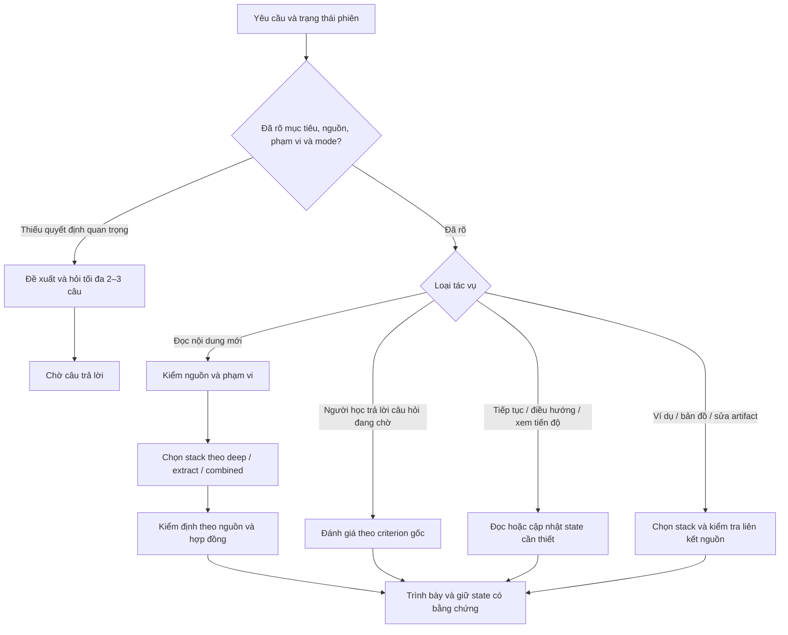

<p align="center">
  
</p>

<h1 align="center">Reading Companion</h1>

<p align="center">
  <strong>Đọc sâu, trích xuất tri thức có nguồn và tiếp tục phiên học có kiểm soát.</strong><br>
  A Vietnamese-first reading companion plugin for OpenAI-compatible agent hosts.
</p>

<p align="center">
  
  <a href="LICENSE"></a>
  
</p>

---

## Mục tiêu

Reading Companion hỗ trợ người học đọc sách và tài liệu theo phạm vi họ chọn. Plugin giữ đường dẫn về nguồn, điều kiện và quan hệ giữa các ý; giải thích hoặc trích xuất theo yêu cầu; và duy trì câu hỏi, checkpoint cùng trạng thái phiên khi có dữ liệu thực.

Plugin định tuyến theo tác vụ thay vì buộc mọi yêu cầu đi qua cùng một chuỗi bước. Nó không tự chứng minh nội dung đúng, không tự lưu trí nhớ tài khoản và không thay thế việc kiểm tra nghĩa bởi người đọc.

## Cách định tuyến



Sơ đồ mô tả các nhánh; mỗi lượt chỉ gọi phần cần thiết. `deep`, `extract` và `combined` là mode đọc. `standard`, `quick`, `chill` và `challenger` là style trình bày, không thay mode. Trong `combined`, lời giải thích và đơn vị tri thức dùng chung IDs; câu hỏi được giữ ở trạng thái chờ đến khi người học phản hồi hoặc yêu cầu chuyển bước.

Với claim nhạy theo thời gian, plugin kiểm tra nguồn hiện tại khi host có công cụ phù hợp. Nếu không truy cập được nguồn, câu trả lời phải ghi rõ phần chưa kiểm. Khả năng đọc file, duyệt web và lưu trạng thái phụ thuộc host cùng công cụ được bật.

## Tài liệu chính

| File | Trách nhiệm |
|---|---|
| [`master-instruction.md`](skills/sid-reading-companion/references/master-instruction.md) | Quy tắc điều khiển, định tuyến và tiêu chí gate |
| [`knowledge-compiler.md`](skills/sid-reading-companion/references/knowledge-compiler.md) | Truy xuất nguồn, ranh giới Knowledge Units, quan hệ và kế hoạch đọc |
| [`reading-protocols.md`](skills/sid-reading-companion/references/reading-protocols.md) | Stacks cho giải thích, extraction, so sánh, đánh giá, biểu diễn và chuyển phiên |
| [`stack-contracts.md`](skills/sid-reading-companion/references/stack-contracts.md) | Hợp đồng input/output, provenance, liên kết ví dụ, câu hỏi và sidecar |
| [`case-benchmark.md`](skills/sid-reading-companion/references/case-benchmark.md) | Định nghĩa benchmark và tiêu chí evidence; không tự báo kết quả chạy |

## Cấu trúc repository

```text
.
├── .github/                     # CI, issue template và PR template
├── .codex-plugin/               # Manifest tương thích
├── assets/                      # Logo
├── evaluation/                  # Bằng chứng chạy thực, tách khỏi case specifications
├── skills/sid-reading-companion/
│   ├── SKILL.md                 # Entry point và pointers
│   ├── agents/openai.yaml       # Metadata skill cho agent host
│   ├── references/              # Controller, compiler, protocols, contracts, benchmark
│   └── scripts/                 # Helper kiểm tra cấu trúc và trạng thái
├── tools/                       # Kiểm tra cấu trúc repository và liên kết tài liệu
├── CHANGELOG.md
├── CONTRIBUTING.md
├── LICENSE
├── PATCH_TABLE.md
├── README.md
└── plugin.json
```

## Bắt đầu

Đính kèm sách hoặc tài liệu, nêu mục tiêu và phạm vi. Nếu mode chưa được chọn, Reading Companion có thể đề xuất `deep`, `extract` hoặc `combined` rồi chờ lựa chọn. Để tiếp tục, cung cấp checkpoint/bản bàn giao hiện có để plugin kiểm nguồn và trạng thái trước khi đi tiếp.

Ví dụ:

```text
Đọc phần 2–3 của tài liệu này theo mode deep. Giữ locator cho từng ý và dừng sau một câu hỏi để tôi trả lời.

Trích xuất các Knowledge Units trong chương 4 theo mode extract. Chỉ ghi số lượng do sách nêu khi có locator; nếu em tự chọn số lượng, ghi tiêu chí chia.

Tiếp tục từ checkpoint đính kèm. Giữ câu hỏi đang chờ, nguồn và phạm vi đã chọn.
```

## Helper và kiểm tra

Các script Python dùng thư viện chuẩn. Chúng kiểm tra cấu trúc graph, contract và trạng thái; chúng không xác nhận diễn giải đúng với sách hay kết quả học của người dùng.

```bash
python -m json.tool plugin.json
python -m json.tool .codex-plugin/plugin.json
python tools/validate_repository.py
python skills/sid-reading-companion/scripts/ia_map.py --help
python skills/sid-reading-companion/scripts/knowledge_compiler.py --help
python skills/sid-reading-companion/scripts/checkpoint.py --help
python skills/sid-reading-companion/scripts/reading_session.py --help
```

GitHub Actions chạy các kiểm tra cấu trúc/CLI này trên Python 3.10–3.12. Chúng không thay thế benchmark output thực, review ngữ nghĩa độc lập, test trên host đã cài plugin hoặc đo kết quả học.

## Evaluation evidence

Benchmark specifications nằm trong `skills/sid-reading-companion/references/case-benchmark.md`. Output thực được lưu riêng trong `evaluation/runs/`; ca chưa có output, chưa có grading hoặc chưa có kết quả người học được ghi `NOT_RUN`. Xem [`evaluation/README.md`](evaluation/README.md) và [`PATCH_TABLE.md`](PATCH_TABLE.md) để biết phạm vi evidence của gói này.

## Capability audit

`-capa` là cách yêu cầu audit năng lực trong hội thoại với plugin, không phải lệnh terminal. Audit chỉ tổng hợp input/output và trạng thái có bằng chứng; không chấm học viên trong phiên đọc thường, không tự sửa hay publish plugin.

## License

Phát hành theo [MIT License](LICENSE).
