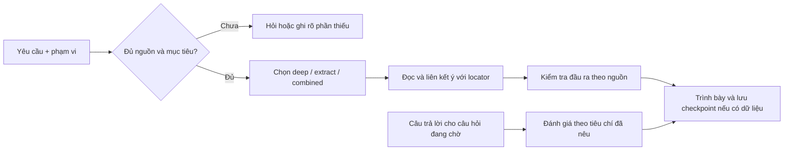

<p align="center">
  
</p>

<h1 align="center">Reading Companion</h1>

<p align="center">
  <strong>Đọc đúng phạm vi. Giữ mạch lập luận. Biết rõ điều gì đến từ sách và điều gì do AI tổ chức.</strong>
</p>

<p align="center">
  <a href="plugin.json"></a>
  <a href="https://github.com/Nohfinl99/Reading_Companion/actions/workflows/validate.yml"></a>
  <a href="LICENSE"></a>
</p>

Reading Companion giúp biến một phạm vi sách hoặc tài liệu thành lời giải thích, đơn vị tri thức và bước học tiếp theo có thể lần ngược về nguồn. Bạn chọn mục tiêu và phạm vi; Companion giữ locator, điều kiện, quan hệ giữa các ý và giới hạn của phần đã đọc.

## Bắt đầu trong một yêu cầu

Đính kèm sách hoặc tài liệu, rồi nêu **mục tiêu**, **phạm vi** và **cách đọc**. Nếu chưa chọn cách đọc, hãy yêu cầu Companion đề xuất; Companion sẽ hỏi lại khi thiếu thông tin làm thay đổi kết quả.

```text
Đọc sâu chương 2, từ mục “Problem Framing” đến hết “Opportunity Mapping”.
Giải thích mạch lập luận, giữ locator cho từng ý và dừng lại bằng một câu hỏi để tôi trả lời.
```

```text
Trích xuất các ý có thể áp dụng từ phần này. Ghi rõ tiêu chí chọn,
ý nào tác giả liệt kê với số lượng xác định, và ý nào là cách em tổ chức.
```

## Chọn cách đọc theo mục tiêu

| Cách đọc | Phù hợp khi bạn muốn | Companion giữ lại |
|---|---|---|
| `deep` | Hiểu khái niệm, điều kiện và mạch lập luận | Giải thích có nguồn, quan hệ giữa các ý và câu hỏi kiểm tra hiểu |
| `extract` | Lấy ra các đơn vị tri thức trong phạm vi chọn | Locator, tiêu chí chọn, nguồn gốc số lượng và quan hệ giữa unit |
| `combined` | Vừa hiểu mạch vừa tạo bộ tri thức có thể xem lại | Dùng chung ID giữa giải thích và unit; câu hỏi vẫn ở trạng thái chờ đến khi bạn trả lời hoặc yêu cầu chuyển bước |

Các nhãn này là cách đọc, không phải cấp độ năng lực. Nếu tác giả không ấn định số lượng, Companion phải ghi rõ khi nó tự chọn số mục và nêu tiêu chí chọn.

## Đầu ra mẫu

Các đoạn dưới đây được trích từ output đã ghi nhận trong run `PS1r4` ngày 2026-10-10. Chúng cho thấy cách hệ thống trình bày giới hạn và xuất xứ của lựa chọn; **đây chưa phải kết quả benchmark đạt**. Output chưa được chấm độc lập, và run được thực hiện qua Codex CLI, không phải trên plugin host đã cài.

<details>
<summary><strong>Khi AI tự chọn số lượng, cần nói rõ đó là lựa chọn biên tập</strong> · PS07</summary>

> “Đây là lựa chọn do AI tổ chức, không phải ‘ba nguyên tắc’ tác giả nêu.”
>
> “Không chọn trong bản gọn: chi phí cơ hội; giá trị khác đơn vị cần tiêu chí so sánh.”

[Xem output đã ghi nhận](evaluation/runs/2026-10-10-ps1r4/PS07/output.md).
</details>

<details>
<summary><strong>Khi nguồn chưa đủ, không suy diễn từ tiêu đề</strong> · PS04</summary>

> “Mình chưa thể giải thích cơ chế […] theo nguồn, vì […] chưa có nội dung chương, hình, caption, hay đoạn mô tả quy trình.”

[Xem output đã ghi nhận](evaluation/runs/2026-10-10-ps1r4/PS04/output.md).
</details>

<details>
<summary><strong>Ví dụ áp dụng phải nối lại unit và giới hạn kết luận</strong> · PS05</summary>

> “Ví dụ này dùng để thấy ranh giới của phép so sánh, không chứng minh phương án nào thật sự tốt hơn.”

[Xem output đã ghi nhận](evaluation/runs/2026-10-10-ps1r4/PS05/output.md).
</details>

## Cách hệ thống xử lý một yêu cầu



Sơ đồ mô tả các nhánh có thể dùng; mỗi lượt chỉ gọi phần cần thiết. Kiểm cấu trúc hoặc tự kiểm không chứng minh diễn giải đúng. Khi nguồn thiếu, Companion phải nêu phần bị ảnh hưởng và chỉ tiếp tục với phần độc lập còn đủ căn cứ.

## Tiếp tục phiên đọc

Khi muốn chuyển phiên, hãy đưa checkpoint hoặc bản bàn giao gần nhất:

```text
Tiếp tục từ checkpoint đính kèm. Kiểm tra nguồn, phạm vi và câu hỏi đang chờ.
Giữ nguyên ID và chỉ tiếp tục phần chưa hoàn tất.
```

Companion chỉ khôi phục trạng thái có trong context hoặc checkpoint được cung cấp; nó không tự khẳng định đã lưu trí nhớ tài khoản.

## Cấu trúc repository

```text
.
├── .github/                     # CI và mẫu issue/PR
├── .codex-plugin/               # Manifest tương thích
├── assets/                      # Logo
├── evaluation/                  # Output đã ghi nhận, tách khỏi định nghĩa case
├── skills/sid-reading-companion/
│   ├── SKILL.md                 # Entry point
│   ├── agents/openai.yaml       # Metadata agent
│   ├── references/              # Controller, compiler, protocols, contracts, benchmark
│   └── scripts/                 # Helper runtime
├── tools/                       # Kiểm tra repository và liên kết tài liệu
├── plugin.json                  # Manifest chính
├── README.md
├── CHANGELOG.md
├── CONTRIBUTING.md
└── LICENSE
```

## Kiểm tra và giới hạn bằng chứng

Chạy các kiểm tra cục bộ từ root repository:

```bash
python -m json.tool plugin.json
python -m json.tool .codex-plugin/plugin.json
python tools/validate_repository.py
python -m compileall -q tools skills/sid-reading-companion/scripts
```

GitHub Actions kiểm tra JSON, cấu trúc, liên kết tài liệu và giao diện helper trên Python 3.10–3.12. Đây là kiểm tra kỹ thuật; chúng không thay thế chấm nghĩa bởi người đọc hoặc thử nghiệm trên plugin host.

Run `PS1r4` có output cho PS01–PS07. Các output còn **UNGRADED**; chấm ngữ nghĩa độc lập, hành vi trên plugin host đã cài và kết quả học của người dùng là `NOT_RUN`. Các case không có output cũng là `NOT_RUN`. Xem [định nghĩa benchmark](skills/sid-reading-companion/references/case-benchmark.md), [chỉ mục kết quả](evaluation/runs/2026-10-10-ps1r4/index.json) và [ghi chú evidence](evaluation/README.md).

## Tài liệu cho người bảo trì

| File | Vai trò |
|---|---|
| [Master instruction](skills/sid-reading-companion/references/master-instruction.md) | Điều khiển, định tuyến và gate |
| [Knowledge compiler](skills/sid-reading-companion/references/knowledge-compiler.md) | Nguồn, phạm vi và Knowledge Units |
| [Reading protocols](skills/sid-reading-companion/references/reading-protocols.md) | Các stack đọc và tạo artifact |
| [Stack contracts](skills/sid-reading-companion/references/stack-contracts.md) | Hợp đồng input/output và state |
| [Patch table](PATCH_TABLE.md) | Nội dung thay đổi trong gói 0.3.3 |

## License

Phát hành theo [MIT License](LICENSE).
