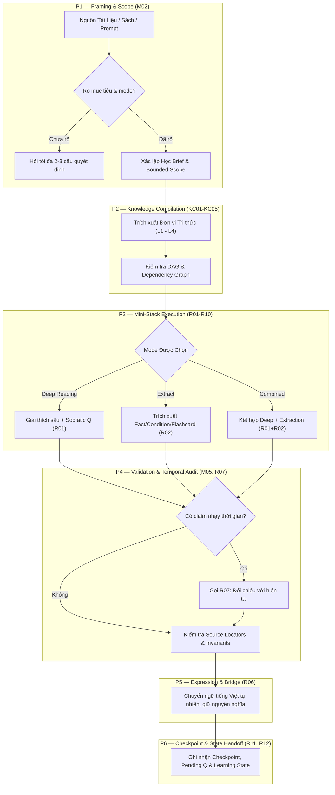

<p align="center">
  
</p>

<h1 align="center">SID Reading Companion</h1>

<p align="center">
  <strong>Trợ lý AI Đọc Sâu, Trích Xuất Tri Thức Có Nguồn & Theo Dõi Tiến Trình Học Tập</strong><br>
  <em>A Vietnamese-first, Source-Grounded Deep Reading & Knowledge Compilation Agent Plugin for OpenAI / Codex.</em>
</p>

<p align="center">
  <a href="https://github.com/agent-plugins"></a>
  <a href="#version"></a>
  <a href="LICENSE"></a>
  <a href="#python"></a>
  <a href="#interactive"></a>
</p>

---

## 📌 Mục Lục (Table of Contents)
- [1. Giới Thiệu (Overview)](#1-giới-thiệu-overview)
- [2. Kiến Trúc Thông Tin & Luồng Hoạt Động (Information Architecture)](#2-kiến-trúc-thông-tin--luồng-hoạt-động-information-architecture)
- [3. Chế Độ Đọc & Phong Cách (Modes & Styles Matrix)](#3-chế-độ-đọc--phong-cách-modes--styles-matrix)
- [4. Cấu Trúc Thư Mục (Repository Structure)](#4-cấu-trúc-thư-mục-repository-structure)
- [5. Hướng Dẫn Cài Đặt & Sử Dụng (Quick Start)](#5-hướng-dẫn-cài-đặt--sử-dụng-quick-start)
- [6. Bộ Công Cụ Kiểm Chuẩn Python (Verification Tooling)](#6-bộ-công-cụ-kiểm-chuẩn-python-verification-tooling)
- [7. Kiểm Định Năng Lực (-capa Audit)](#7-kiểm-định-năng-lực--capa-audit)
- [8. Đóng Góp & Giấy Phép (Contributing & License)](#8-đóng-góp--giấy-phép-contributing--license)

---

## 1. Giới Thiệu (Overview)

Khi đọc các tài liệu chuyên sâu, sách kỹ thuật hoặc bài báo nghiên cứu, người học thường gặp phải các vấn đề:
- **Hiện tượng ảo giác (AI Hallucination)**: Mô hình ngôn ngữ tự bịa ra thông tin không có trong tài liệu.
- **Tóm tắt hời hợt**: Mất đi các điều kiện biên, tiên đề và bối cảnh áp dụng.
- **Mất dấu tiến trình**: Không ghi nhớ được các điểm nghẽn nhận thức hoặc câu hỏi đang chờ người học trả lời.

**SID Reading Companion** giải quyết triệt để vấn đề này thông qua kiến trúc **Source-Grounded Agentic Workflow**:
- 🎯 **Neo chặt vào nguồn (Source Grounding)**: Bắt buộc gắn kết mọi luận điểm với số trang, phân đoạn cụ thể trong tài liệu.
- 🔄 **Hội thoại Feynman – Socratic**: Không giảng thao thao bất tuyệt; đặt câu hỏi dẫn dắt từng bước để người học tự kiểm chứng mức độ hiểu.
- 🧩 **Knowledge Compiler (Biên dịch tri thức)**: Tách tài liệu thành các Đơn vị Tri thức (Knowledge Units) từ L1 đến L4, vẽ bản đồ quan hệ DAG chống phụ thuộc vòng.
- ⏰ **Rà soát thông tin nhạy thời gian (R07 Sensitivity Protocol)**: Tự động đối chiếu những tuyên bố có tính thời sự với thực tế ngày nay.

---

## 2. Kiến Trúc Thông Tin & Luồng Hoạt Động (Information Architecture)

Hệ thống được thiết kế theo mô hình **Phân tầng 6 Pha (P1-P6)** với cơ chế Kiểm duyệt (Gate Check) nghiêm ngặt giữa các pha:



### Bản đồ Tài liệu Tham chiếu (Canonical References Architecture)

| Tài liệu Tham chiếu | Vai trò Kiến trúc | Nội dung cốt lõi |
|---|---|---|
| [`master-instruction.md`](skills/sid-reading-companion/references/master-instruction.md) | **Controller (M01–M07)** | Điều khiển routing matrix, phân luồng lệnh, quy chuẩn gate validation và quản trị phiên đọc. |
| [`knowledge-compiler.md`](skills/sid-reading-companion/references/knowledge-compiler.md) | **Compiler Engine (KC01–KC05)** | Định nghĩa bản thể tri thức (Ontology), phân cấp tri thức L1–L4, quan hệ DAG và kế hoạch đọc. |
| [`reading-protocols.md`](skills/sid-reading-companion/references/reading-protocols.md) | **Protocols (R00–R12)** | Các prompt mini-stack chi tiết cho từng chế độ đọc, chấm điểm câu trả lời và ghi nhận checkpoint. |
| [`case-benchmark.md`](skills/sid-reading-companion/references/case-benchmark.md) | **Evaluation Suite (B01–B06)** | Bộ benchmark hồi quy, chẩn đoán lỗi năng lực (E1 capability audit) cho hệ thống. |

---

## 3. Chế Độ Đọc & Phong Cách (Modes & Styles Matrix)

Hệ thống phân biệt rạch ròi giữa **Chế độ đọc (Mode)** và **Phong cách tương tác (Style)**. Đổi phong cách không làm thay đổi chế độ cốt lõi.

### 📚 Chế Độ Đọc (Modes)
- **Deep Reading (`deep`)**: Dành cho tài liệu trừu tượng hoặc khái niệm mới. Giải thích từng lớp nghĩa, kèm ví dụ thực tế và câu hỏi Socratic để kích hoạt tư duy chủ động.
- **Knowledge Extraction (`extract`)**: Trích xuất có cấu trúc: Định nghĩa, Điều kiện tiên quyết, Ngoại lệ, Chỉ số định lượng và Thẻ ghi nhớ (Flashcard Q&A).
- **Combined (`combined`)**: Đọc sâu các luận điểm trọng yếu, đồng thời trích xuất thẻ tri thức có số định danh (Unit IDs) đồng bộ.

### 🎨 Phong Cách Trình Bày (Styles)
| Phong cách | Đặc điểm tương tác | Phù hợp với |
|---|---|---|
| **Standard** | Cân bằng, chuẩn mực sư phạm, chi tiết đầy đủ | Học tài liệu chuyên sâu, ôn thi |
| **Quick** | Tinh gọn, đi thẳng vào định nghĩa và tóm tắt cốt lõi | Xem trước tài liệu, tra cứu nhanh |
| **Chill** | Giọng điệu thân thiện, ví dụ đời thường, giảm tải thuật ngữ | Khởi động, giải trí kỹ thuật |
| **Challenger** | Phản biện sắc bén, xoáy sâu vào các giả định và lỗ hổng luận cứ | Chuẩn bị phỏng vấn, thẩm định học thuật |

---

## 4. Cấu Trúc Thư Mục (Repository Structure)

Toàn bộ dự án được đóng gói theo chuẩn [OpenAI Plugin Specification](https://agent-plugins.org/schemas/1.0.0/plugin.schema.json):

```text
sid-reading-companion/
├── .codex-plugin/
│   └── plugin.json                   # Cấu hình tương thích môi trường OpenAI Codex
├── .github/
│   ├── workflows/
│   │   └── validate.yml              # CI/CD tự động kiểm tra cú pháp và contract scripts
│   ├── ISSUE_TEMPLATE/               # Mẫu báo cáo lỗi chuẩn
│   └── PULL_REQUEST_TEMPLATE.md      # Quy chuẩn gửi Pull Request
├── assets/
│   └── logo.svg                      # Logo nhận diện thương hiệu SID Reading Companion
├── skills/
│   └── sid-reading-companion/
│       ├── SKILL.md                  # Entry point chỉ dẫn nạp skill cho AI Agent
│       ├── agents/
│       │   └── openai.yaml           # Metadata giao diện hiển thị cho OpenAI Agent
│       ├── references/               # 4 Tài liệu tham chiếu chuẩn (Canonical References)
│       │   ├── master-instruction.md # Bộ điều khiển luồng & Routing
│       │   ├── knowledge-compiler.md # Đặc tả cấu trúc tri thức L1-L4
│       │   ├── reading-protocols.md  # Chi tiết các bước thao tác (Protocols)
│       │   └── case-benchmark.md     # Kịch bản kiểm thử & Benchmark
│       └── scripts/                  # Bộ công cụ Python kiểm chuẩn độc lập (No dependencies)
│           ├── checkpoint.py         # Kiểm tra tính toàn vẹn trạng thái phiên học
│           ├── ia_map.py             # Validate đồ thị DAG và xuất sơ đồ Mermaid
│           ├── knowledge_compiler.py # Kiểm tra hợp đồng biên dịch tri thức
│           └── reading_session.py    # Quản lý phiên đọc và chuyển giao trạng thái
├── .gitignore                        # Cấu hình loại trừ rác Git & cache Python
├── CONTRIBUTING.md                   # Hướng dẫn quy trình đóng góp cho cộng đồng
├── LICENSE                           # Giấy phép mã nguồn mở MIT
├── plugin.json                       # Khai báo Plugin Manifest chuẩn
└── README.md                         # Tài liệu giới thiệu & Kiến trúc thông tin
```

---

## 5. Hướng Dẫn Cài Đặt & Sử Dụng (Quick Start)

### Cách 1: Nạp Plugin vào Nền tảng Hỗ trợ Agent Plugin
1. Nạp repository này vào nền tảng tương thích (OpenAI Agent Plugins / Codex Workspace).
2. Hệ thống sẽ tự động nhận diện `plugin.json` và kích hoạt Skill `sid-reading-companion`.

### Cách 2: Sử dụng Prompt Mở Đầu (Starter Prompts)
Sao chép một trong các prompt mẫu sau để bắt đầu phiên đọc:

```text
# Bắt đầu đọc tài liệu mới
"Dùng $sid-reading-companion để đọc tài liệu đính kèm này. Hãy đề xuất chế độ phù hợp và để tôi chọn cách tiếp cận."

# Trích xuất tri thức bài bản
"Đọc chương 3 tài liệu này và trích xuất thành các đơn vị tri thức có kèm số trang nguồn, điều kiện áp dụng và flashcard."

# Tiếp tục phiên học trước
"Tiếp tục từ checkpoint này: giữ nguyên các lựa chọn đã chốt và kiểm tra phần nội dung còn dang dở."
```

---

## 6. Bộ Công Cụ Kiểm Chuẩn Python (Verification Tooling)

Repository đi kèm với bộ scripts viết bằng Python chuẩn (Pure Python, không yêu cầu cài đặt thêm thư viện ngoài qua `pip`). Bạn có thể sử dụng trực tiếp để kiểm tra tính hợp lệ của dữ liệu phiên đọc:

### Kiểm tra Bản đồ Kiến trúc Thông tin (IA Map)
```bash
python skills/sid-reading-companion/scripts/ia_map.py --input path/to/graph.json --output path/to/diagram.md
```

### Kiểm Chuẩn Biên Dịch Tri Thức (Knowledge Compiler Contract)
```bash
python skills/sid-reading-companion/scripts/knowledge_compiler.py --input path/to/nodes.json --output path/to/plan.json
```

### Kiểm Tra State Checkpoint
```bash
python skills/sid-reading-companion/scripts/checkpoint.py --input path/to/checkpoint.json
```

---

## 7. Kiểm Định Năng Lực (-capa Audit)

Để chẩn đoán năng lực hoạt động của Agent mà không làm biến dạng phiên đọc của người học, gọi lệnh:
```text
SID Reading Companion -capa
```
Agent sẽ kích hoạt luồng kiểm định **E1 Capability Audit** (theo chuẩn `master-instruction.md` mục M07 và `case-benchmark.md`):
- Đối chiếu raw evidence thực tế thu thập được.
- Định vị chính xác lỗi thuộc tầng nào: *Controller*, *Compiler*, *Protocols*, hay *Verification Script*.
- Đề xuất giải pháp patch cụ thể mà không tự ý sửa đổi phiên đọc đang diễn ra.

---

## 8. Đóng Góp & Giấy Phép (Contributing & License)

- **Đóng góp**: Mọi ý kiến đóng góp, thảo luận và đề xuất tính năng mới đều được hoan nghênh. Vui lòng đọc kỹ [CONTRIBUTING.md](CONTRIBUTING.md) trước khi tạo Pull Request.
- **Giấy phép (License)**: Dự án được phát hành theo giấy phép mã nguồn mở **[MIT License](LICENSE)**. Tự do sử dụng, chỉnh sửa và tích hợp vào các hệ thống cá nhân cũng như thương mại.
