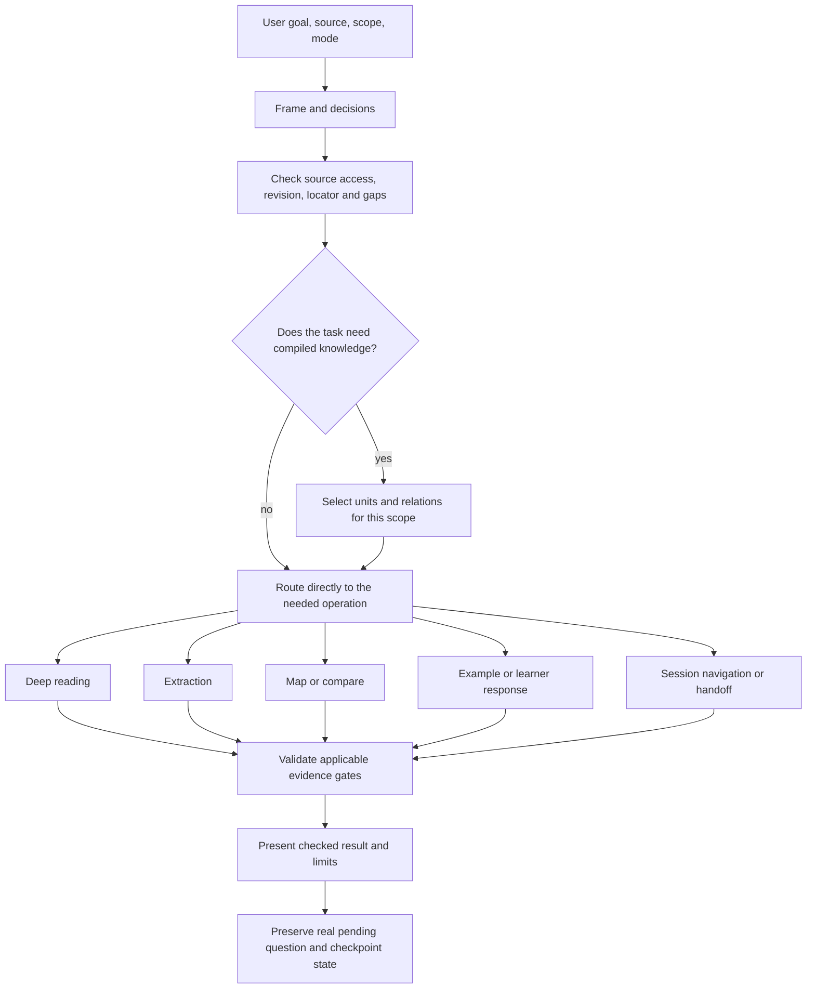

# Reading Companion Architecture

[Tiếng Việt](architecture.vi.md) · [README](../README.en.md)

## Scope and audience

Reading Companion is a Vietnamese-first conversational plugin for reading books and documents. It takes the user's goal, scope, source and choices, then produces an explanation or knowledge artifact that can be traced back to evidence. The plugin does not include books, a standalone reading service, its own MCP server, account memory or multi-writer synchronization.

This guide explains how the components work together. Detailed rules remain owned by the [Master instruction](../skills/sid-reading-companion/references/master-instruction.md), [Knowledge compiler](../skills/sid-reading-companion/references/knowledge-compiler.md), [Reading protocols](../skills/sid-reading-companion/references/reading-protocols.md) and [Stack contracts](../skills/sid-reading-companion/references/stack-contracts.md).

## Conditional workflow

The diagram shows conditional routes, not a mandatory pipeline. A navigation request can use existing state without recompiling the source; a learner response can be assessed against its current question contract; a fresh extraction may need source planning and unit compilation. Dynamic claims invoke the currency check when required by the controller.

## Component responsibilities

| Component | Owns | Does not claim |
|---|---|---|
| `SKILL.md` | Entry point and reference routing | Full book content or account memory |
| Master instruction M01–M07 | Authority, framing, route selection, applicable gates, continuity and maintenance audit | That every route runs in every turn |
| Knowledge Compiler KC01–KC05 | Source/task metadata, unit boundaries, relations, compilation plan and helper limits | Semantic correctness from a valid JSON plan |
| Reading protocols R00–R15 | Reading, extraction, comparison, assessment, mapping, examples, session state and handoff | A result when its input/evidence is absent |
| Stack contracts SC00–SC05 | Shared artifact, provenance, question, argument, example and gate data | A second schema in a protocol or README |
| Case benchmark B01–B06, B08 | Case definitions and evaluation procedure | Passing results without input, output and grading evidence |
| Python helpers | Structural and state operations documented by their interfaces | Book comprehension, web-source verification, semantic grading or learner outcomes |
| GitHub Actions | Manifest, repository/link, compile and CLI smoke checks | Installed-host behavior or learning gain |

## Design decisions

1. **One owner per rule.** The controller owns routing; the compiler owns units and counts; contracts own shared data; protocols own task execution; R14 owns runtime validation; benchmark references define evaluation cases.
2. **Conditional decomposition.** The workflow selects only the operation needed. This avoids turning a reading assistant into an unnecessary fixed-stage pipeline.
3. **Stable runtime paths.** `SKILL.md`, manifests and CI refer to the current skill, reference and script layout. Human documentation lives under `docs/` without moving those runtime dependencies.
4. **Progressive disclosure.** The README supports orientation and first use. These guides explain architecture. Canonical references hold full runtime rules and schemas.
5. **Evidence layers stay separate.** Structural checks, generated outputs, independent semantic review, installed-host tests and learner outcomes answer different questions.

## Session and data boundaries

Source identity, revision/hash when available, scope, locator, unit IDs/revisions, coverage, real assessment evidence, pending/paused question and support state are preserved only when present. A checkpoint is an explicit artifact or context handoff, not implicit account memory. `combined` shares IDs between explanation and units; it does not answer a pending learner question. Details and field constraints are in [SC00–SC05](../skills/sid-reading-companion/references/stack-contracts.md).

## Related guides

- [Principle-to-owner map](principles.en.md)
- [Quality and evidence model](quality.en.md)
- [Runtime routes](../skills/sid-reading-companion/references/master-instruction.md)
- [Data contracts](../skills/sid-reading-companion/references/stack-contracts.md)
