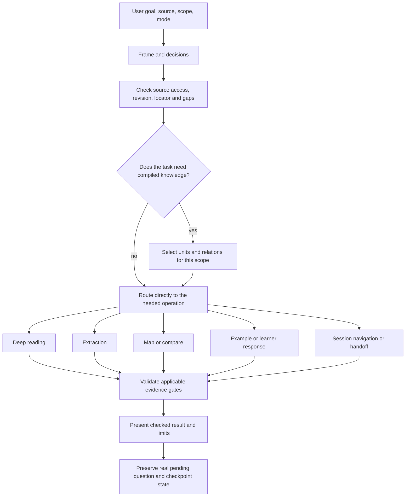

# Kiến trúc Reading Companion

[English version](architecture.en.md) · [README](../README.vi.md)

## Phạm vi và người dùng

Reading Companion là plugin hội thoại hướng dẫn đọc sách và tài liệu bằng tiếng Việt trước. Hệ thống nhận mục tiêu, phạm vi, nguồn và lựa chọn của người dùng; sau đó tạo lời giải thích hoặc artifact tri thức có thể truy nguyên. Plugin không bao gồm sách, dịch vụ đọc tài liệu độc lập, MCP server riêng, bộ nhớ tài khoản hay đồng bộ nhiều người ghi.

Tài liệu này giải thích cách các thành phần phối hợp. Các quy tắc chi tiết vẫn thuộc [Master instruction](../skills/sid-reading-companion/references/master-instruction.md), [Knowledge compiler](../skills/sid-reading-companion/references/knowledge-compiler.md), [Reading protocols](../skills/sid-reading-companion/references/reading-protocols.md) và [Stack contracts](../skills/sid-reading-companion/references/stack-contracts.md).

## Luồng xử lý theo nhu cầu

This diagram shows conditional routes, not a required pipeline. A navigation request can use saved state without recompiling the source; a learner response can be assessed against its existing question contract; a fresh extraction may need source planning and unit compilation. Dynamic claims invoke the currency check when the controller says it applies.

Sơ đồ thể hiện định tuyến có điều kiện, không phải pipeline bắt buộc. Lệnh điều hướng có thể dùng state sẵn có mà không biên dịch lại nguồn; câu trả lời người học có thể được đánh giá theo hợp đồng câu hỏi hiện hành; trích xuất mới có thể cần lập kế hoạch nguồn và biên dịch units. Claim thay đổi theo thời gian gọi kiểm tra currency khi controller quy định.

## Component responsibilities / Trách nhiệm thành phần

| Component | Owns | Does not claim |
|---|---|---|
| `SKILL.md` | Entry point and reference routing | Full book content or account memory |
| Master instruction M01–M07 | Authority, framing, route selection, applicable gates, continuity and maintenance audit | That every route runs in every turn |
| Knowledge Compiler KC01–KC05 | Source/task metadata, unit boundaries, relations, compilation plan and helper limits | Semantic correctness from a valid JSON plan |
| Reading protocols R00–R15 | Reading, extraction, comparison, assessment, mapping, examples, session state and handoff operations | A result when its input/evidence is absent |
| Stack contracts SC00–SC05 | Shared artifact, provenance, question, argument, example and gate data | A second schema in a protocol or README |
| Case benchmark B01–B06, B08 | Case definitions and evaluation procedure | Passing results unless input, output and grading evidence exist |
| Python helpers | Structural and state operations documented by their interfaces | Book comprehension, web-source verification, semantic grading or learner outcomes |
| GitHub Actions | Manifest, repository/link, compile and CLI smoke checks | Installed-host behavior or learning gain |

## Decisions and rationale

1. **One owner per rule.** Controller owns routing; compiler owns units and counts; contracts own shared data; protocols own task execution; R14 owns runtime validation; benchmark references define evaluation cases.
2. **Conditional decomposition.** The workflow selects only the operation needed. This avoids turning a reading assistant into an unnecessary fixed-stage pipeline.
3. **Stable runtime paths.** `SKILL.md`, manifests and CI refer to the current skill/reference/script layout. Human documentation lives under `docs/` without moving those runtime dependencies.
4. **Progressive disclosure.** README supports orientation and first use. These guides explain architecture. Canonical references hold full runtime rules and schemas.
5. **Evidence layers stay separate.** Structural checks, generated outputs, independent semantic review, installed-host tests and learner outcomes answer different questions.

## Session and data boundaries

Source identity, revision/hash when available, scope, locator, unit IDs/revisions, coverage, real assessment evidence, pending/paused question and support state are preserved only when present. A checkpoint is an explicit artifact or context handoff, not implicit account memory. `combined` shares IDs between explanation and units; it does not answer a pending learner question. Details and field constraints are in [SC00–SC05](../skills/sid-reading-companion/references/stack-contracts.md).

## Related guides

- [Principle-to-owner map](principles.vi.md)
- [Quality and evidence model](quality.vi.md)
- [Runtime routes](../skills/sid-reading-companion/references/master-instruction.md)
- [Data contracts](../skills/sid-reading-companion/references/stack-contracts.md)
